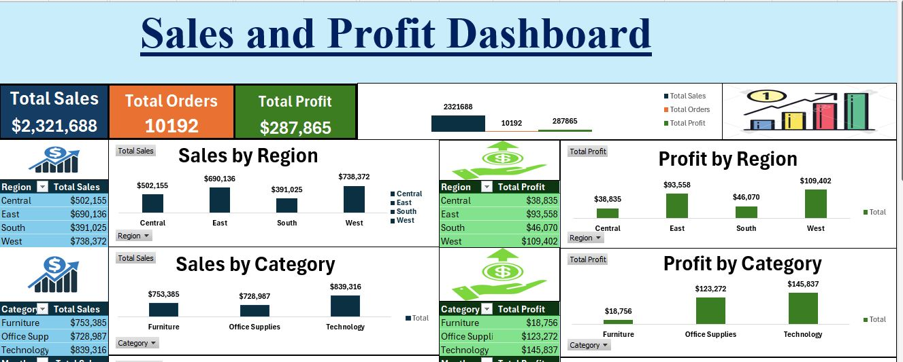
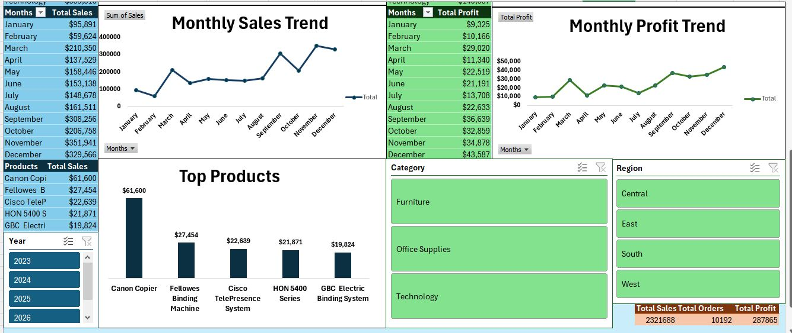

# 📊 Sales and Profit Dashboard

## 📌 Project Overview
This project analyzes sales and profit data using Excel to identify trends and generate business insights.

## 🛠 Tools Used
- Microsoft Excel

## 📊 Key Insights
- West region generated the highest profit
- Technology category performed best
- Profit peaks in September and December highlighting seasonal trends.

## 📷 Dashboard Preview

## 📁 Dataset
- SampleSuperstore.csv

## 🎯 Conclusion
This dashboard helps understand sales performance and supports data-driven decision-making.
